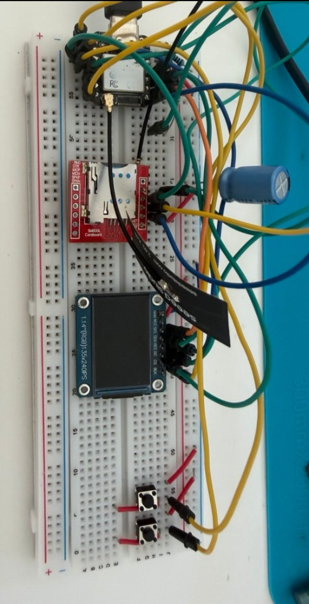
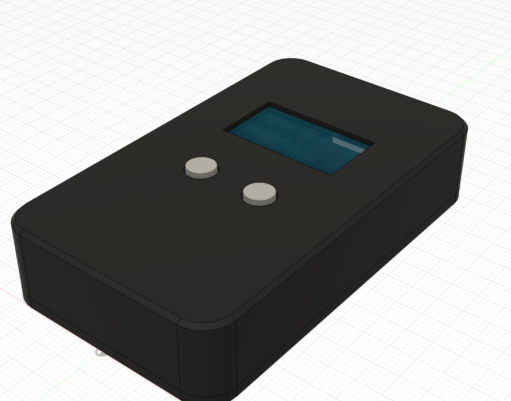
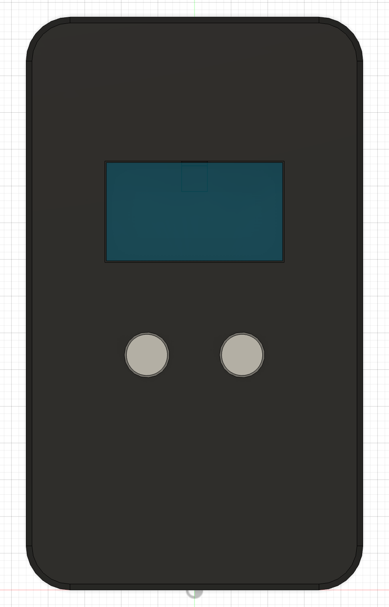
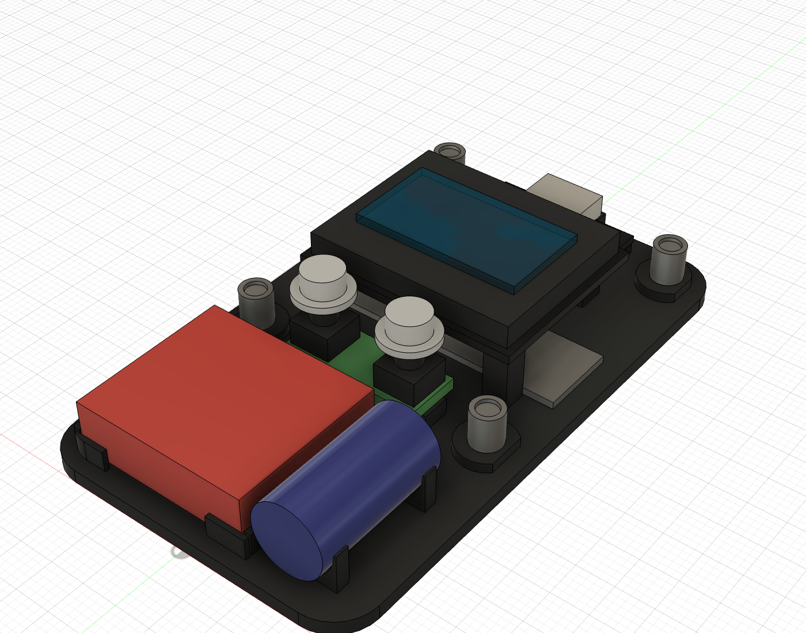
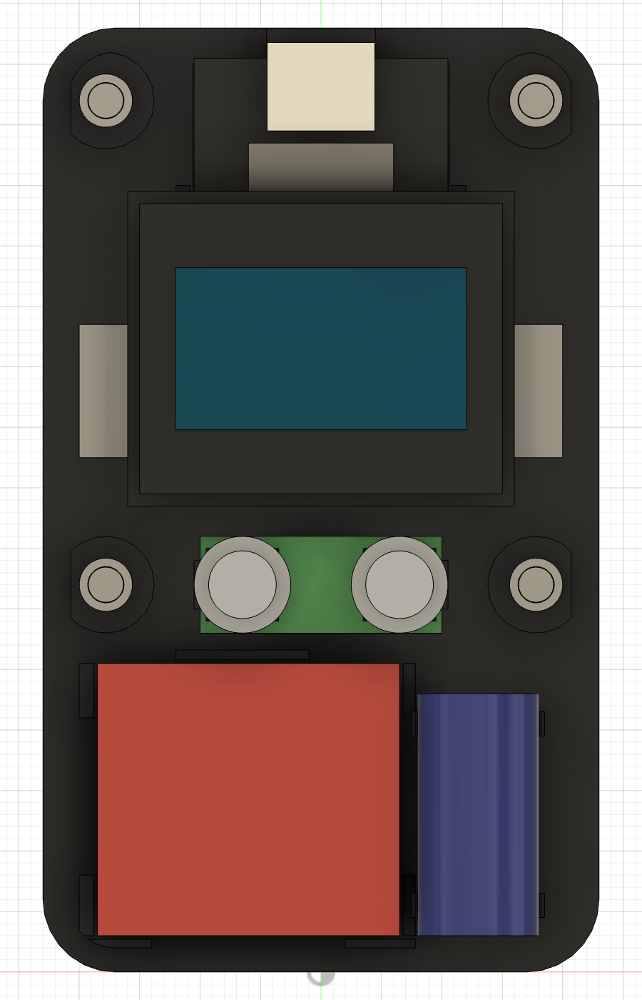
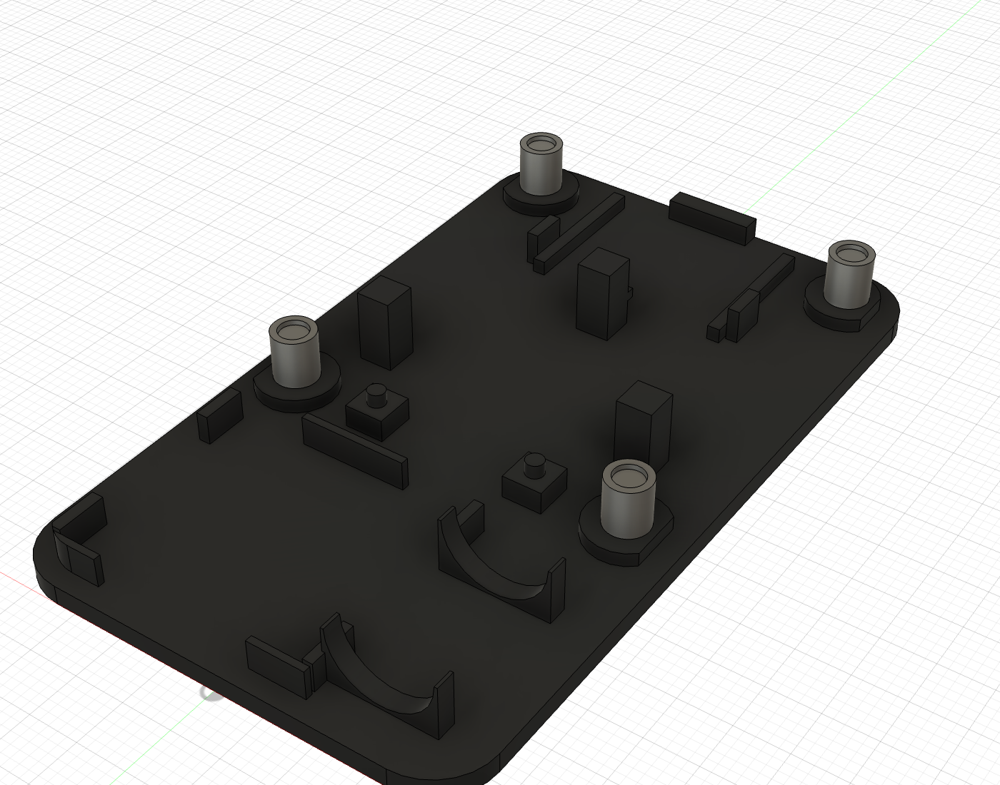
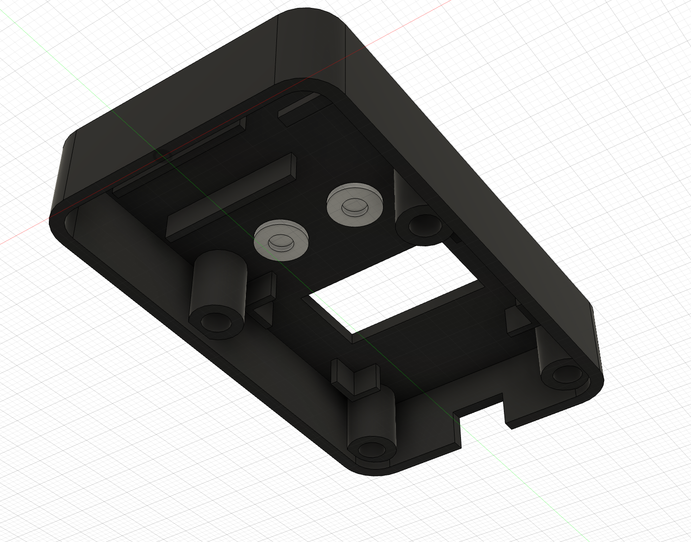

# SMS ↔ Telegram gateway (TinyGo)

A small **TinyGo** firmware for **Seeed XIAO ESP32-S3** that bridges a **SIM800L** cellular modem and **Telegram Bot API** over Wi‑Fi, with a Nokia-style **ST7789** status screen.

Use it as a practical example of:

- TinyGo on ESP32-S3 (UART, SPI display, GPIO buttons)
- Software TLS + HTTPS to `api.telegram.org` on a constrained MCU
- AT-command modem control (SMS, USSD, CLIP / missed calls)
- Long-polling Telegram bots without a cloud relay

```text
  Phone / SMS ──► SIM800L ──UART──► XIAO ESP32-S3 ──Wi‑Fi TLS──► Telegram
                      ▲                    │
                      │                    └── ST7789 status UI
                 USSD / CLIP
```

## Features

| Feature | Behavior |
|---------|----------|
| Incoming SMS | Forwarded to your chat (UCS-2 decoded) |
| Missed calls | `AT+CLIP` → Telegram after ring silence |
| Outgoing SMS | `/sms +7900… text` |
| USSD / balance | `/balance` (`*100#`), `/ussd *code#` |
| Missed list | `/missed` (modem MC/RC phonebook) |
| Display | Signal, Wi‑Fi, clock, SMS/CALLS counts, softkeys |
| Buttons | D0 = Next / Inbox, D1 = OK / Refresh (to GND) |

Bot commands are defined once in [`firmware/commands.go`](firmware/commands.go) and registered with `setMyCommands`.

## Hardware

- [Seeed XIAO ESP32-S3](https://wiki.seeedstudio.com/xiao_esp32s3_getting_started/)
- SIM800L (or compatible) + SIM with SMS
- ST7789V 1.14″ IPS (135×240)
- Two momentary buttons to GND
- Bulk capacitor on modem VCC (current peaks)

### Breadboard prototype

Current bring-up on a full-size breadboard (XIAO → SIM800L → ST7789 → softkeys + bulk cap):



### Enclosure concept — 46 × 78 × 16 mm, two-part, 4× M3 recessed

Handheld body, landscape 1.14″ window (matches the firmware's 240×135 `Rotation90` frame), two softkeys under the screen, XIAO USB-C exits through the top edge for power/flash. Upper shell + flat bottom cover, held by four M3 × 6 button-head screws (ISO 7380) into brass heat-set inserts from the M1.4–M6 kit in the Notion inventory; the heads sit in counterbores, flush with the bottom. M6 was the first pick, but an M6 head (Ø10.5) cannot hide in the corner of a 46 mm body — the pillar centre would have to move 2.5 mm inward and the XIAO no longer fits between the top pillars.

| View | Preview |
|------|---------|
| Exterior |  |
| Front |  |
| Packing (shell removed) |  |
| Packing, top-down |  |
| Cover fixtures |  |
| Shell inside (pocket ribs, USB U-notch, flanged caps) |  |
| Bottom (recessed M3 heads) |  |

```text
 y=78 ┌──────[USB-C]──────┐   XIAO ESP32-S3 under the display, USB out the top wall
      │ (M3)          (M3)│   pillars Ø8 at (±17.8, 32/72), insert hole Ø4.4 × 6
      │  ┌─────────────┐  │
      │  │ ST7789 1.14″│  │   module 32×26 lies flat, glass flush in 24.5×13.8 window
      │  └─────────────┘  │
      │ (M3) (N)  (O) (M3)│   6×6 tact switches (H=7) on a 20×8 strip, flanged caps
      │  ┌────────┐ ┌──┐  │
      │  │SIM800L │ │C │  │   modem 25×23×7 + Ø10×20 bulk cap side by side
      │  └────────┘ └──┘  │   Wi-Fi flex antenna 40×11 on the cover under the display
 y=0  └───────────────────┘
```

Shell: 2 mm walls, R6 corners, 0.8 mm chamfer on the top edge. Cover: 2 mm plate with four Ø8 bosses rising to z 3.4 under the pillars; each has a Ø3.4 through hole and a Ø6.2 × 1.9 counterbore from below, so the Ø5.7 × 1.65 button head ends 0.25 mm inside the plate and a 1.5 mm floor remains under the pillar. Screw stack: head 0.25–1.9, thread 1.9–7.9, insert 3.4–8.4 (M3 × 5 insert, ≥ 4.5 mm engagement). Every placeholder plus the inserts and screws was checked against the cavity bounds and pairwise interference in Fusion (25 bodies, 0 hits). Model lives in the open Fusion session as an unsaved parametric design (`ow/oh/od/wall/pillar_od/insert_hole/cover_hole` user parameters).

Hole sizes at a glance: Ø3.4 = M3 clearance, Ø4.4 = heat-set insert body (knurled OD ≈ 4.6, nominal core 4.0 — measure your kit and adjust `insert_hole`), Ø6.2 = head counterbore.

#### Fixtures per node (no glue, everything is captured between shell and cover)

| Node | Shell side | Cover side | Play |
|------|-----------|------------|------|
| Buttons (6×6 tact, 4-pin, from the inventory kit, H = 7 mm) | Ø6.2 holes at (±6.5, 32); caps have a Ø8 × 1 flange under the wall, Ø5.6 stem 0.8 mm proud, Ø3.7 socket for the plunger — a cap cannot fall out once the shell is on | 2 posts 4×4 (z 2–4.3) with Ø1.8 pegs into Ø2 holes in the strip at (±8.5, 32) | 0.1 mm pre-travel |
| Display 32×26 module | 4 L-shaped corner ribs (1.2 mm, z 9.3–14) pocket the PCB with 0.3 mm clearance; glass sits in the window | 3 posts 3.5×3.5 to z 9.4 at (±14, 40.5) and (0, 56) | 0.1 mm |
| XIAO ESP32-S3 | USB-C U-notch (9.2 wide, open to the shell's bottom edge) so the board slides in with the cover | rails under the PCB (|x| 9.3–10.6, z 2–3.5), side stops (|x| 10.8–12), hook lip on the (0, 56) post over the PCB edge, filler tab closing the notch below the connector | 0.3 mm side |
| SIM800L | 2 hold-down ribs (y 8–9.2 and 19–20.2, z 9.7–14) | corner stops 1.2 mm (z 2–5) on three sides + a bar at y 25.8–26.6 | 0.2–0.5 mm |
| Bulk cap Ø10 × 20 | finger x 8–18, y 12–14, z 12.7–14 | two U-saddles (R5.2, z 2–7.5) at y 4.5–6.5 and 19.5–21.5 | 0.2 mm |
| Wi-Fi flex | — | adhesive, lies flat at y 42.5–53.5 between the display posts | — |

#### Assembly / disassembly

1. Heat-set four M3 brass inserts into the shell pillars (Ø4.4 hole, 6 mm deep; insert flush with the pillar face).
2. Drop both caps into the shell from inside (flange down). Solder wires to the display (remove the straight header), lay it face-down into the pocket ribs.
3. On the cover: stick the flex antenna, press the button strip onto the pegs (trim switch pins ≤ 2 mm), seat the SIM800L into its stops and the capacitor into the saddles, slide the XIAO onto the rails under the hook lip, USB-C towards the notch.
4. Close the cover — the posts lift the display/strip against the shell, the filler tab closes the U-notch under the connector — and fit four M3 × 6 button-head screws from below; they end up flush. Disassembly is the reverse; no glue anywhere.

#### Files

| File | What |
|------|------|
| [`hardware/enclosure/stl/enclosure-shell.stl`](hardware/enclosure/stl/enclosure-shell.stl) | Upper shell — flip 180° in the slicer so the front face lies on the bed |
| [`hardware/enclosure/stl/enclosure-cover.stl`](hardware/enclosure/stl/enclosure-cover.stl) | Bottom cover — print as exported (counterbores down) |
| [`hardware/enclosure/stl/button-cap-x2.stl`](hardware/enclosure/stl/button-cap-x2.stl) | Button cap, print two, as exported (flange down) |
| [`hardware/enclosure/sms-telegram-enclosure.step`](hardware/enclosure/sms-telegram-enclosure.step) | Full assembly incl. component placeholders, inserts and screws |
| [`hardware/enclosure/sms-telegram-enclosure.f3d`](hardware/enclosure/sms-telegram-enclosure.f3d) | Fusion 360 source with the parametric timeline |

#### Printing (bed 100 × 160 mm is enough for both parts side by side)

- Shell: top face on the bed, no supports — pillars, pocket ribs, SIM ribs and cap finger are vertical walls, the top-edge chamfer replaces the old R1.5 fillet that would have left a 0.75 mm step at layer 2. The USB U-notch has no bridge.
- Cover: flat on the bed, all fixtures are 1.2–4 mm vertical features; the Ø1.8 pegs are the smallest detail (0.4 nozzle, ≥ 3 perimeters). The 0.85 mm hook lip prints as a short overhang.
- Caps: flange down, PETG/PLA; 0.2 mm layer keeps the Ø3.7 socket dimension.
- Pillar wall around the Ø4.4 insert hole is 1.8 mm — fine for heat-set M3; the counterbores print as clean 1.9 mm pockets on the bed side.

Open points:

- No screws in the inventory — buy M3 × 6 button head (ISO 7380); M3 × 8 would bottom out in the 6 mm insert hole.
- GSM antenna for the SIM800L is not modelled yet; the Wi-Fi flex is placed under the display, away from the modem.

### Pinout (XIAO)

| Function | XIAO | GPIO |
|----------|------|------|
| Modem RX ← MCU TX | **D6** | 43 (U0TXD) |
| Modem TX → MCU RX | **D7** | 44 (U0RXD) |
| Modem RST (idle HIGH) | **D2** | 3 |
| TFT SCL | D8 | 7 |
| TFT SDA (MOSI) | D10 | 9 |
| TFT CS | D9 | 8 |
| TFT DC | D4 | 5 |
| TFT RES | D5 | 6 |
| TFT BLK | D3 | 4 |
| TFT VCC / GND | 3V3 / GND | |
| Button Next | D0 → GND | 1 |
| Button OK | D1 → GND | 2 |

Cross TX/RX for the modem (UART0 IO_MUX pins).

## Requirements

- [TinyGo](https://tinygo.org/) **0.42+** (`xiao-esp32s3` target)
- `esptool` (for flash if `tinygo flash` MD5-check fails)
- Wi‑Fi credentials + a Telegram bot token ([@BotFather](https://t.me/BotFather))

## Quick start

```bash
# 1) Apply required TinyGo / espradio IRQ patches (once per TinyGo install)
./patches/tinygo/apply.sh      # full UART + optional dual-core bits
./patches/espradio/apply.sh    # Wi‑Fi CPU IRQ 12 → 18 (UART keeps 12)

# 2) Secrets (not committed)
cp secrets.mk.example secrets.mk
# edit: WIFI_SSID, WIFI_PASSWORD, TELEGRAM_BOT_TOKEN, TELEGRAM_CHAT_ID

# 3) Build & flash
make flash PORT=/dev/cu.usbmodem*
```

If `make flash` fails on checksum, build then flash manually:

```bash
make firmware
esptool --chip esp32s3 -p /dev/cu.usbmodem* write-flash 0x0 bin/firmware.elf
# or use the .bin produced by your usual tinygo build -o bin/firmware.bin …
```

Open the bot in Telegram, send `/start` or `/help`. Incoming SMS and missed calls appear in the chat automatically.

## Telegram bot API usage (TinyGo)

The firmware talks HTTPS directly with a small software TLS stack under [`firmware/swtls`](firmware/swtls) and a thin client in [`firmware/telegram.go`](firmware/telegram.go):

1. **`getMe`** — connectivity check at boot  
2. **`setMyCommands`** — populate the bot menu from `botCommands`  
3. **`getUpdates`** — long-poll (timeout 0 in loop; handled in firmware main)  
4. **`sendMessage`** — SMS / missed-call / command replies  

Secrets are injected at link time (no plaintext in the repo):

```makefile
-ldflags="-X main.ssid=… -X main.password=… -X main.botToken=… -X main.chatID=…"
```

Heap is tight: close idle TLS after each request, keep stack around **12 KB**, and avoid large JSON buffers.

### Example commands

```text
/help
/balance
/missed
/sms +79001112233 hello from TinyGo
/ussd *100#
```

## Project layout

```text
firmware/          main TinyGo app (modem, UI, Telegram, swtls)
patches/tinygo/    ESP32-S3 UART (+ experimental cores) for TinyGo 0.42
patches/espradio/  move Wi‑Fi IRQ off UART’s CPU interrupt
uart-test/         minimal UART↔modem bring-up
secrets.mk.example template for Wi‑Fi / bot secrets
```

## Notes & limits

- **Boot order matters:** display → Wi‑Fi/NTP → UART/modem → Telegram. Configuring UART before `espradio` can clear `INTENABLE` and kill RX.
- **IRQ map:** GPIO≈10, UART=**12**, Wi‑Fi=**18** (after patches). Dual-core (`SCHEDULER=cores`) is experimental and currently unstable with Wi‑Fi ([tinygo#5358](https://github.com/tinygo-org/tinygo/issues/5353)).
- Screen sleeps after 30 s idle; wake on button or SMS / missed call.
- This is a hobby gateway — not a hardened SMS appliance.

## License

Use and modify as you like for personal / educational projects. Upstream TinyGo and driver licenses still apply.
